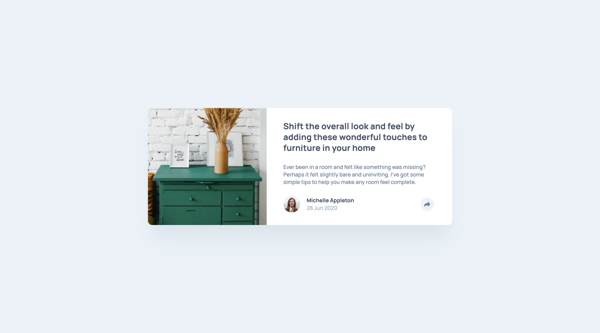

# 🌐 Frontend Mentor - Article Preview Component

This is a solution to the [Article Preview Component](https://www.frontendmentor.io/challenges/article-preview-component-dYBN_pYFT).  
Frontend Mentor challenges help you improve your coding skills by building realistic projects. 💻🚀

---

## 📑 Table of Contents

- [🔍 Overview](#-overview)
  - [🖼️ Screenshot](#-screenshot)
  - [🔗 Links](#-links)
- [🛠️ My Process](#-my-process)
  - [🧱 Built With](#-built-with)
  - [📚 What I Learned](#-what-i-learned)
  - [🔄 Continued Development](#-continued-development)
- [👤 Author](#-author)

---

## 🔍 Overview

### 🖼️ Screenshot

### 🔗 Links

- 💡 Solution URL: [Article Preview Component Solution URL](https://www.frontendmentor.io/solutions/responsive-article-preview-component-1Ibx2gX5FP)
- 🌐 Live Site URL: [Article Preview Component live](https://danijel374.github.io/fem-article-preview-component/)

---

## 🛠️ My Process

Before jumping into the code, I took a moment to plan things out. Thinking through the layout and structure helped me write cleaner and more organized code. ✍️🧠

### 🧱 Built With

- ✅ Semantic HTML5 markup
- 🎨 CSS custom properties
- 🧩 BEM naming convention
- 📐 Flexbox
- 🧱 CSS Grid
- 📱 Mobile-first workflow

### 📚 What I Learned

- Nothing much new but it was still a great practice.

### 🔄 Continued Development

I'm focusing more on:

- Improving my responsive design skills
- Mastering layout techniques

---

## 👤 Author

- 🧑‍💻 Frontend Mentor - [@danijel374](https://www.frontendmentor.io/profile/danijel374)
- 🐦 Twitter - [@danijel3741](https://www.twitter.com/danijel3741)

---

Thanks for checking out my solution! 😊
